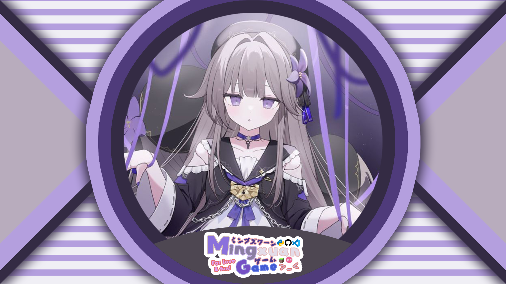

<!-- markdownlint-disable MD033 MD041 -->
<p align="center">
  
  
</p>

<div align="center">

_Created by [Jiang-Red](https://github.com/Jiang-Red)_

</div>

# MingxuanGame's live-workspace

我的直播工作区。

包含我直播的封面、布局和一个基于 [NoneBot2](https://github.com/nonebot/nonebot2) 和 [B站直播间适配器](https://github.com/MingxuanGame/nonebot-adapter-bilibili-live) 的直播机器人。

## 特性

- 支持响应命令并作出相应的操作
- 支持将直播间的弹幕使用特定接口通知到指定游戏
- 可在 OBS 使用的弹幕姬

## 安装

### 前置条件

- [uv](https://docs.astral.sh/uv) 包管理器
- Python 3.12 或更高版本
- [Node.js](https://nodejs.org/) 和 [pnpm](https://www.npmjs.com/) 构建弹幕姬前端页面
- 可选：[Git LFS](https://git-lfs.github.com/) 用于管理[大型静态资源文件](#静态文件)

### 克隆仓库并安装依赖

```bash
git clone https://github.com/MingxuanGame/live-workspace.git
cd live-workspace
uv sync
```

弹幕姬会自动通过 pnpm 安装依赖并构建前端页面。

## 配置

修改 NoneBot 配置文件 `.env` 或者 `.env.*`。可参考 [NoneBot 文档](https://nonebot.dev/docs/appendices/config) 进行配置。

### B站直播间适配器 （必须）

参考 [B站直播间适配器文档](https://github.com/MingxuanGame/nonebot-adapter-bilibili-live?tab=readme-ov-file#%E9%85%8D%E7%BD%AE) 进行配置。两种方式任选其一即可。

### osu! 客户端

如果需要使用 osu! API 功能，需要在配置文件中添加以下配置：

```env
# osu! v1 API 密钥
OSU_API_V1_APIKEY=your_osu_api_key
```

### tosu

如果需要获取 tosu 提供的数据，需要在配置文件中添加以下配置：

```env
TOSU_HOST=127.0.0.1
TOSU_PORT=24050
TOSU_RECONNECT_INTERVAL=2
TOSU_RECONNECT_MAX_ATTEMPTS=5
```

一般情况下 tosu 会默认监听在 `localhost:24050`，所以通常不需要修改这里的设置。

### OBS WebSocket

如果需要使用 OBS WebSocket 功能，需要在配置文件中添加以下配置：

```env
# OBS WebSocket 服务器地址
OBS_ADDRESS="ws://localhost:4455"
# 服务器密码
OBS_PASSWORD="your_obs_password"
OBS_IDENTIFY_TIMEOUT=10
```

在 OBS Studio 中的 工具 -> WebSocket 服务器设置 中启用 WebSocket 服务器，并设置密码。

### 通知器

通知器会将弹幕等信息通过特定接口发送到指定游戏。需要在配置文件中添加以下配置：

```env
# 通知器类型，参考下方列出的通知器配置
NOTIFIER=your_notifier
```

#### osu!(stable) 通知器

osu!(stable) 通知器通过 IRC 将消息发给自己的形式来通知 osu! 客户端。需要在配置文件中添加以下配置：

```env
NOTIFIER=osu_stable

# 你的 osu! 用户名
NOTIFIER_OSU_STABLE_TARGET=your_osu_username
# 你的 IRC 用户名，和 osu! 用户名相同
NOTIFIER_OSU_STABLE_USERNAME=your_irc_username
# 你的 IRC 密码，在 https://osu.ppy.sh/home/account/edit#legacy-api 创建
NOTIFIER_OSU_STABLE_PASSWORD=your_irc_password
```

#### osu!(lazer) 通知器

osu!(lazer) 通知器通过使用 [ExternalOperation ruleset](https://github.com/MingxuanGame/LazerExternalOperation) 向游戏内发送通知来通知 osu! 客户端。需要在配置文件中添加以下配置：

```env
NOTIFIER=osu_lazer

# 你的 ExternalOperation 服务器地址，默认为 http://localhost:34790
NOTIFIER_OSU_LAZER_SERVER="http://localhost:34790"
```

## 启动

```bash
uv run nb run
```

通常情况下，机器人会自动连接到直播间并开始工作。

## 命令

### 点歌

`/b <bid> [mods]` - 点歌命令，`bid` 是 osu! 谱面 ID，`mods` 是可选的游戏 Mod 列表（如 `HDHR`）。例如：

```txt
/b 123456 HDHR
```

## 弹幕姬

弹幕姬会在 `http://localhost:8080/danmaku/?room=<roomid>` 提供一个 Web 页面来显示直播间的弹幕。你可以在 OBS 中使用浏览器源来加载这个页面。

将 `<roomid>` 替换为你想要显示弹幕的直播间 ID。例如：

```txt
http://localhost:8080/danmaku/?room=1713541725
```

弹幕姬由四部分组成：

- 礼物区（悬浮）：显示直播间的礼物和醒目留言。
- 消息区：显示直播间的弹幕消息。
- 通知区：显示进入房间、点赞等通知消息。
- 命令区：显示直播间的可用命令。

### CSS 样式

#### CSS 变量

弹幕姬提供以下 CSS 变量可供自定义：

##### 基础样式

| 变量名 | 默认值 | 说明 |
|--------|--------|------|
| `--danmaku-bg-color` | `transparent` | 背景颜色 |
| `--danmaku-text-color` | `#fff` | 文字颜色 |
| `--danmaku-text-shadow` | `0 1px 2px rgba(0, 0, 0, 0.8), 0 0 2px rgba(0, 0, 0, 0.8)` | 文字阴影 |
| `--danmaku-username-color` | `#8dbcd4` | 用户名颜色 |
| `--danmaku-font-family` | `'Microsoft YaHei', 'PingFang SC', ...` | 字体 |
| `--danmaku-font-size` | `18px` | 基础字号 |

##### 粉丝牌等级颜色

| 变量名 | 默认值 | 说明 |
|--------|--------|------|
| `--medal-bg-color` | `rgba(0, 0, 0, 0.3)` | 粉丝牌背景 |
| `--medal-level-1-4` | `#61c05a` | 1-4级 (绿色) |
| `--medal-level-5-8` | `#5896de` | 5-8级 (蓝色) |
| `--medal-level-9-12` | `#a068f1` | 9-12级 (紫色) |
| `--medal-level-13-16` | `#ff6b9e` | 13-16级 (粉色) |
| `--medal-level-17-20` | `#ff8c00` | 17-20级 (橙色) |
| `--medal-level-21-24` | `#e73b4d` | 21-24级 (红色) |
| `--medal-level-25-40` | `#c0a550` | 25-40级 (金色) |

##### 舰长颜色

| 变量名 | 默认值 | 说明 |
|--------|--------|------|
| `--guard-level-1` | `#e73b4d` | 总督 |
| `--guard-level-2` | `#a068f1` | 提督 |
| `--guard-level-3` | `#6eb9ff` | 舰长 |

##### 礼物相关

| 变量名 | 默认值 | 说明 |
|--------|--------|------|
| `--gift-bg-color` | `rgba(255, 215, 0, 0.1)` | 礼物消息背景 |
| `--gift-name-color` | `#ffd700` | 礼物名称颜色 |
| `--gift-num-color` | `#ff6b6b` | 礼物数量颜色 |

##### 醒目留言 (SuperChat)

以下变量兼容 blivechat 的 YouTube 付费消息样式：

| 变量名 | 默认值 | 说明 |
|--------|--------|------|
| `--yt-live-chat-paid-message-primary-color` | `#1e88e5` | 醒目留言主色 |
| `--yt-live-chat-paid-message-secondary-color` | `#1565c0` | 醒目留言次色 (头部) |
| `--yt-live-chat-paid-message-header-color` | `#fff` | 头部文字颜色 |
| `--yt-live-chat-paid-message-author-name-color` | `#fff` | 作者名颜色 |
| `--yt-live-chat-paid-message-color` | `#fff` | 消息内容颜色 |

##### 大航海 (上舰)

| 变量名 | 默认值 | 说明 |
|--------|--------|------|
| `--yt-live-chat-sponsor-color` | `#0f9d58` | 上舰消息背景色 |
| `--yt-live-chat-sponsor-text-color` | `#fff` | 上舰消息文字颜色 |

#### CSS 类名

弹幕姬支持以下 CSS 类名，同时兼容 blivechat 的选择器：

| 类名 / 选择器 | 说明 |
|---------------|------|
| `.room` | 房间容器 |
| `.messages` | 消息列表容器 |
| `.message` / `yt-live-chat-text-message-renderer` | 单条消息 |
| `.avatar` / `#author-photo` | 用户头像 |
| `.author-name` / `#author-name` | 用户名 |
| `.message-text` / `#message` | 消息内容 |
| `.medal` / `yt-live-chat-author-badge-renderer` | 粉丝牌 |
| `.paid-message` / `yt-live-chat-paid-message-renderer` | 醒目留言 |
| `.membership-item` / `yt-live-chat-membership-item-renderer` | 上舰消息 |
| `.gift` | 礼物消息 |
| `.ticker` / `yt-live-chat-ticker-renderer` | 付费消息固定栏 |
| `.enter` | 进场消息 |
| `.like` | 点赞消息 |

#### 示例

以下是一些常见的自定义样式示例：

##### 修改背景颜色和字体大小

```css
:root {
  --danmaku-bg-color: rgba(0, 0, 0, 0.5);
  --danmaku-font-size: 20px;
}
```

##### 隐藏头像

```css
.avatar,
#author-photo {
  display: none !important;
}
```

##### 隐藏粉丝牌

```css
.medal,
yt-live-chat-author-badge-renderer {
  display: none !important;
}
```

##### 自定义用户名颜色

```css
:root {
  --danmaku-username-color: #ff69b4;
}
```

##### 在 OBS 中使用

在 OBS 的浏览器源设置中，找到"自定义 CSS"输入框，粘贴你的自定义样式即可。例如：

```css
:root {
  --danmaku-font-size: 22px;
  --danmaku-username-color: #ffcc00;
}

.avatar {
  display: none !important;
}
```

## 静态文件

静态文件包含以下目录：

- `images/` - 存放直播封面等图片资源

其中 PSD 文件使用 Git LFS 管理。在克隆仓库时请确保安装了 Git LFS，并使用 `git lfs pull` 命令下载 PSD 文件。

一些图片设计存储在[即时设计](https://js.design)。你可以通过下方的链接访问：

- 直播背景：[live-stream-bg](https://js.design/f/pTCa33?p=kclPNPYPCZ&mode=design)

## 许可

所有静态资源文件遵循 [CC BY-NC 4.0](https://creativecommons.org/licenses/by-nc/4.0/) 许可协议

所有源代码文件遵循 MIT 许可协议

查看 [LICENSE](./LICENSE.md) 文件了解详情。

## 致谢

- [Jiang-Red](https://github.com/Jiang-Red) 为我创作了直播封面和布局设计。
